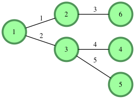
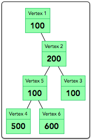

Here is the exact question text from the problem statement:

---

## Cut the Tree

There is an undirected tree where each vertex is numbered from $1$ to $n$, and each contains a data value. The sum of a tree is the sum of all its nodes' data values. If an edge is cut, two smaller trees are formed. The difference between two trees is the absolute value of the difference in their sums.

Given a tree, determine which edge to cut so that the resulting trees have a minimal difference between them, then return that difference.

### Example

`data = [1, 2, 3, 4, 5, 6]`

`edges = [[1, 2], [1, 3], [2, 6], [3, 4], [3, 5]]`

In this case, node numbers match their weights for convenience. The graph is shown below.

| Edge Cut | Tree 1 Sum | Tree 2 Sum | Absolute Difference |
| --- | --- | --- | --- |
| 1 | 8 | 13 | 5 |
| 2 | 9 | 12 | 3 |
| 3 | 6 | 15 | 9 |
| 4 | 4 | 17 | 13 |
| 5 | 5 | 16 | 11 |

The minimum absolute difference is $3$.

> **Note:** The given tree is always rooted at vertex $1$.

### Function Description

Complete the `cutTheTree` function in the editor below.

`cutTheTree` has the following parameter(s):

* `int data[n]`: an array of integers that represent node values
* `int edges[n-1][2]`: a 2 dimensional array of integer pairs where each pair represents nodes connected by the edge

### Returns

* `int`: the minimum achievable absolute difference of tree sums

### Input Format

The first line contains an integer $n$, the number of vertices in the tree.

The second line contains $n$ space-separated integers, where each integer denotes the data value, $data[i]$.

Each of the subsequent $n-1$ lines contains two space-separated integers $u$ and $v$ that describe edge $i$ in tree $G$.

### Constraints

* $3 \le n \le 10^5$
* $1 \le data[i] \le 1001$, where $1 \le i \le n$