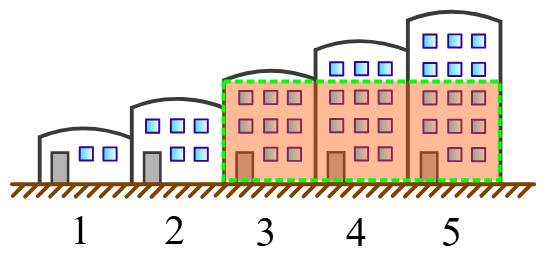

Here is the full text of the problem from the page:

---

## Largest Rectangle

Skyline Real Estate Developers is planning to demolish a number of old, unoccupied buildings and construct a shopping mall in their place. Your task is to find the largest solid area in which the mall can be constructed.

There are a number of buildings in a certain two-dimensional landscape. Each building has a height, given by $h[i]$ where $i \in [1, n]$. If you join $k$ adjacent buildings, they will form a solid rectangle of area:

$$k \times \min(h[i], h[i + 1], \dots, h[i + k - 1])$$

---

### Example

$$h = [3, 2, 3]$$

A rectangle of height $h = 2$ and length $k = 3$ can be constructed within the boundaries. The area formed is $h \cdot k = 2 \cdot 3 = 6$.



---

### Function Description

Complete the function `largestRectangle` in the editor below. It should return an integer representing the largest rectangle that can be formed within the bounds of consecutive buildings.

`largestRectangle` has the following parameter(s):

* `int h[n]`: the building heights

### Returns

* `long`: the area of the largest rectangle that can be formed within the bounds of consecutive buildings

---

### Input Format

* The first line contains $n$, the number of buildings.
* The second line contains $n$ space-separated integers, each the height of a building.

---

### Constraints

* $1 \le n \le 10^5$
* $1 \le h[i] \le 10^6$

---

### Sample Input

```text
5
1 2 3 4 5

```

### Sample Output

```text
9

```

### Explanation

An illustration of the test case shows that choosing the last 3 buildings (heights 3, 4, 5) gives a rectangle of height 3 and width 3, leading to an area of $3 \times 3 = 9$.